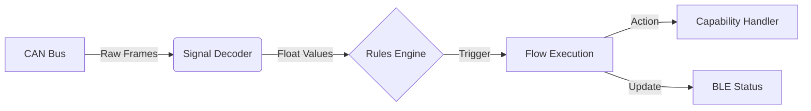

# Core Concepts & Architecture

W4RPBLE is designed to bridge the gap between low-level CAN bus signals and high-level automation rules controllable via Bluetooth Low Energy (BLE).

## System Architecture

The library operates as a pipeline that transforms raw binary data into actionable events.

### 1. The Data Pipeline
*   **Ingestion:** The **TWAI Driver** (Two-Wire Automotive Interface) listens for CAN frames. We support disjoint filters in software because hardware filters are often too limited (mask/code based) for disjoint sets of IDs (e.g., `0x100` and `0x7E0`).
*   **Decoding:** Raw 64-bit payloads are masked and shifted according to the **Signal Definition** (Start Bit, Length, Big/Little Endian, Factor, Offset) to produce a `float` value (e.g., `Engine Speed = 3000.5`).
*   **State Tracking:** A `Signal` object caches its `last_value`, `last_update_ms`, and `ever_set` flag. This allows rules to check for "freshness".

### 2. The Rules Engine
Instead of hardcoding logic (`if (rpm > 3000)`), W4RPBLE uses a dynamic **Node-based** evaluation system.
*   **Nodes**: Atomic logic units. A `ConditionNode` checks `Signal(0) > 50`.
*   **Flows**: A collection of nodes. If **ALL** root nodes in a flow evaluate to `TRUE`, the flow triggers.
*   **Debounce/Cooldown**:
    *   **Debounce**: "Must stay true for X ms" (prevents flickering).
    *   **Cooldown**: "Wait X ms before triggering again" (prevents spam).

### 3. Capabilities (The "Hands")
A **Capability** is an abstraction for "Something this hardware can do".
*   **Decoupled Design**: The Rules Engine doesn't know about PWM or GPIOs. It just knows "Trigger Capability `exhaust_flap` with parameter `amount=100`".
*   **Registration**: You map the string ID `exhaust_flap` to a C++ function `onExhaustFlap`. This keeps your business logic clean and testable.

### 4. BLE Interface (The "Mouth")
BLE is used for two things:
1.  **Configuration**: Uploading new Rules and Flow definitions (JSON).
2.  **Live Monitoring**: Streaming cached Signal values to the phone for a "Dashboard" view.

> **Design Decision:** We use a custom "Streaming Protocol" over BLE Notifications because standard characteristics have a 512-byte limit, and a full Ruleset can be 10KB+.
