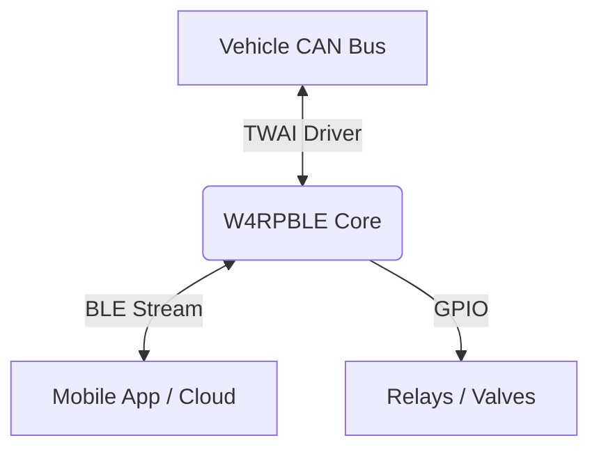

# Bridge Architecture

The **W4RPBLE** library transforms the ESP32 into an intelligent bridge between the vehicle's CAN bus and external interfaces (BLE App, Hardware I/O).

## The "Bridge" Pattern

Unlike traditional CAN sniffers that just dump data, W4RPBLE implements an **Autonomous Bridge** architecture.

### 1. Autonomous Operation
The Bridge logic resides **on the chip**, not in the App.
*   **Safety**: If the phone disconnects, the rules (e.g., "Open valve at 4000 RPM") continue to execute.
*   **Speed**: Decisions happen in microseconds (validating against 2000fps CAN traffic), which is impossible over Bluetooth latency.

### 2. The Twin Data Model
The Bridge maintains a "Digital Twin" of the relevant vehicle state.
*   **Signals**: Real-time variables extracted from CAN frames.
*   **Shadow State**: The mobile app receives state updates (`d:s:rpm:4000`) to mirror this internal state seamlessly.

### 3. Bidirectional Flow
*   **Downstream (Vehicle -> App)**: CAN Frames -> Signals -> Rules -> Status Updates.
*   **Upstream (App -> Vehicle)**: Rules Upload (`SET:RULES`) -> Config Buffer -> Logic Engine -> Action Execution.
